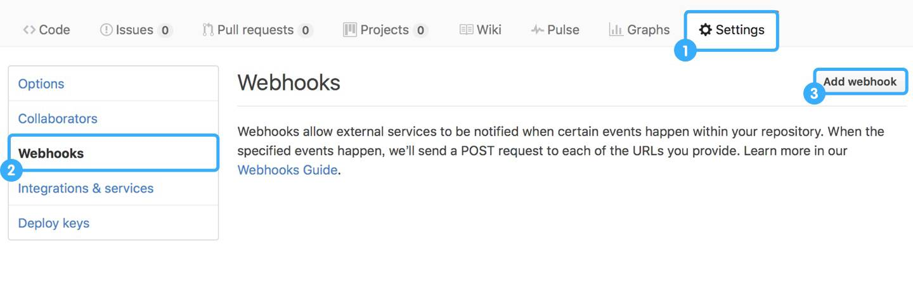
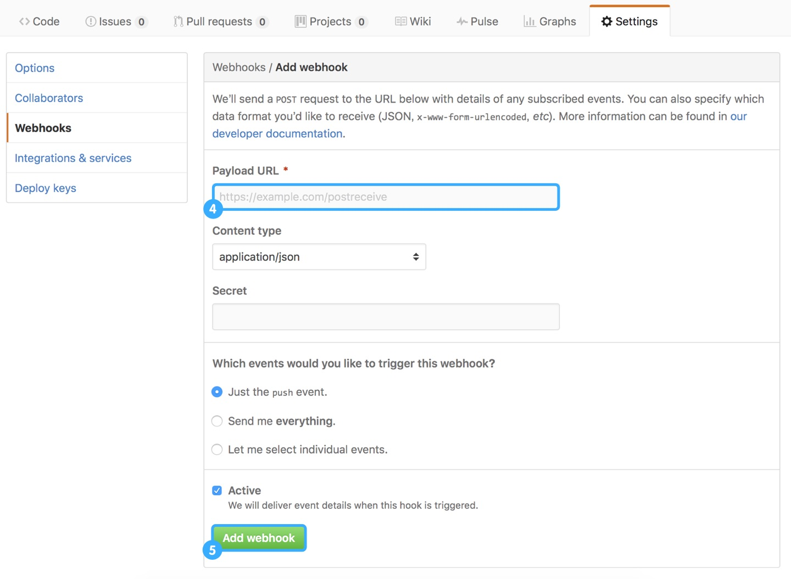

#### 瞎搞webhook
> Webhooks是GitHub提供的一个API。Webhooks可以在GitHub仓库(repositories)发生事件(比如提交代码,创建分支，发布版本)时，通知到其他服务器。Webhook实质上就是一个callback

##### 在GitHub中设置项目的webhook

1. 进入 GitHub 代码库，依次点击「Settings」、「Webhooks & Services」、「Add Webhook」

2. 填入对应的Webhook地址，即可完成配置

  
##### 神奇的工具  
[公网映射工具 ngrok](https://ngrok.com/)
