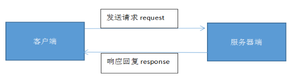
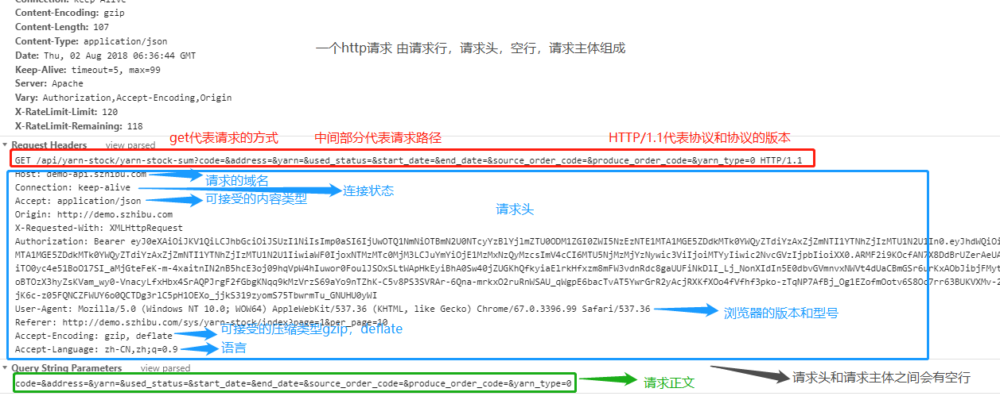
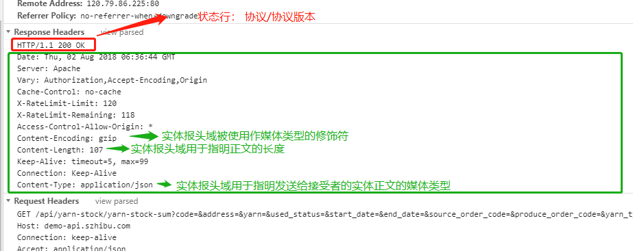

## HTTP 协议

### 请求
> 一个http请求由*请求行*，*请求头*，*空行*，*请求主体*组成

#### 请求头中的请求方式（http/1.1新增5种）：

* GET 请求指定的页面信息，并返回实体主体
*  HEAD 类似于get请求，只不过返回的响应中没有具体的内容，用于获取报头
* POST 向指定资源提交数据进行处理请求（例如提交表单或者上传文件）。数据被包含在请求体中。POST请求可能会导致新的资源的建立和/或已有资源的修改。
* PUT 从客户端向服务器传送的数据取代指定的文档的内容。
* DELETE 请求服务器删除指定的页面。

### 响应
> 一个http响应由*状态行*，*响应头*，*空行*，*响应主体*组成
> 

#### 响应头
* Content-Disposition：附件只需要把文件名给过去就可以，这个名称就是下载时显示的文件名称
* content-type：文件类型

#### 状态码
[戳我查看](https://suyunlongsy.github.io/#/detail/19.10.31-HTTP状态码.md)

### HTTP工作原理

1. 客户端连接到Web服务器
> 一个HTTP客户端，通常是浏览器，与Web服务器的HTTP端口（默认为80）建立一个TCP套接字连接
>（TCP用主机的IP地址加上主机上的端口号作为TCP连接的端点，这种端点就叫做套接字（socket））

2. 发送HTTP请求
> 通过TCP套接字，客户端向Web服务器发送一个文本的请求报文，一个请求报文由请求行、请求头部、空行和请求数据4部分组成。

3. 服务器接受请求并返回HTTP响应
> Web服务器解析请求，定位请求资源。服务器将资源复本写到TCP套接字，由客户端读取。一个响应由状态行、响应头部、空行和响应数据4部分组成。

4. 释放连接TCP连接
>若connection 模式为close，则服务器主动关闭TCP连接，客户端被动关闭连接，释放TCP连接;若connection 模式为keepalive，则该连接会保持一段时间，在该时间内可以继续接收请求

> [TCP工作方式](https://baike.baidu.com/item/TCP/33012?fr=aladdin#6)

5. 客户端浏览器解析HTML内容
> 客户端浏览器首先*解析状态行*，查看表明请求是否成功的*状态码*。然后解析每一个*响应头*，响应头告知以下为若干字节的HTML文档和文档的字符集。客户端浏览器读取响应数据HTML，根据HTML的语法对其进行格式化，并在浏览器窗口中显示。

### 在浏览器地址栏输入URL按回车后经历的流程

1、浏览器向 DNS 服务器请求解析该 URL 中的域名所对应的 IP 地址;

2、解析出 IP 地址后，根据该 IP 地址和默认端口 80，和服务器建立TCP连接;

3、浏览器发出读取文件(URL中域名后面部分对应的文件)的HTTP 请求，该请求报文作为TCP三次握手的第三个报文的数据发送给服务器;

4、服务器对浏览器请求作出响应，并把对应的 html 文本发送给浏览器;

5、释放TCP连接;

6、浏览器将该 html 文本并显示内容;