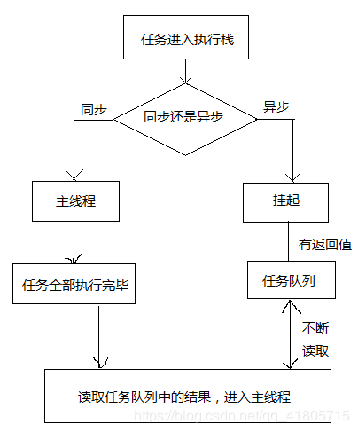

## 事件循环（Event Loop）
> Event Loop即事件循环，是解决javaScript单线程运行阻塞的一种机制。

> 一个例子开胃
```
//请写出输出内容
async function async1() {
    console.log('async1 start');
    await async2();
    console.log('async1 end');
}
async function async2() {
	console.log('async2');
}

console.log('script start');

setTimeout(function() {
    console.log('setTimeout');
}, 0)

async1();

new Promise(function(resolve) {
    console.log('promise1');
    resolve();
}).then(function() {
    console.log('promise2');
});
console.log('script end');


/*
script start
async1 start
async2
promise1
script end
async1 end
promise2
setTimeout
*/
```

### 一.执行栈、事件队列和事件循环原理

#### EventLoop的相关概念

1、堆（Heap）
堆表示一大块非结构化的内存区域，对象，数据被存放在堆中

2、栈（Stack）
栈在javascript中又称执行栈，调用栈，是一种后进先出的数组结构，
Javascript 有一个 主线程（main thread）和 调用栈(或执行栈call-stack)，主线各所有的任务都会被放到调用栈等待主线程执行。
JS调用栈采用的是后进先出的规则，当函数执行的时候，会被添加到栈的顶部，当执行栈执行完成后，就会从栈顶移出，直到栈内被清空。


3、队列（Queue）
队列即任务队列Task Queue，是一种先进先出的一种数据结构。在队尾添加新元素，从队头移除元素。

当javascript代码执行的时候会将不同的变量存于内存中的不同位置：`堆（heap）`和`栈（stack）`中来加以区分。其中，堆里存放着一些`对象`。而栈中则存放着一些`基础类型变量`以及对象的`指针`。 但是我们这里说的执行栈和上面这个栈的意义却有些不同。

我们知道，当我们调用一个方法的时候，js会生成一个与这个方法对应的`执行环境（context）`，又叫``执行上下文`。这个执行环境中存在着这个方法的`私有作用域`，`上层作用域的指向，方法的参数`，这个作用域中定义的`变量`以及这个作用域的`this对象`。 而当一系列方法被依次调用的时候，因为js是单线程的，同一时间只能执行一个方法，于是这些方法被排队在一个单独的地方。这个地方被称为**执行栈**。

当一个脚本第一次执行的时候，js引擎会解析这段代码，并将其中的同步代码按照执行顺序加入执行栈中，然后从头开始执行。如果当前执行的是一个方法，那么`js会向执行栈中添加这个方法的执行环境`，然后进入这个执行环境继续执行其中的代码。当这个执行环境中的代码 执行完毕并返回结果后，`js会退出这个执行环境并把这个执行环境销毁，回到上一个方法的执行环境`。这个过程反复进行，直到执行栈中的代码全部执行完毕。

一个方法执行会向执行栈中加入这个方法的执行环境，在这个执行环境中还可以调用其他方法，甚至是自己，其结果不过是在执行栈中再添加一个执行环境。这个过程可以是无限进行下去的，除非发生了栈溢出，即超过了所能使用内存的最大值。

以上的过程说的都是同步代码的执行。那么当一个异步代码（如发送ajax请求数据）执行后会如何呢？前文提过，js的另一大特点是`非阻塞`，实现这一点的关键在于下面要说的这项机制——**事件队列（Task Queue）**。

js引擎遇到一个异步事件后并不会一直等待其返回结果，而是会将这个事件挂起，继续执行执行栈中的其他任务。
当这个异步事件返回结果后，js会将这个事件加入与当前执行栈不同的另一个队列，我们称之为**事件队列（任务队列）**。
被放入事件队列不会立刻执行其回调，而是`等待当前执行栈中的所有任务都执行完毕`， 主线程处于闲置状态时，主线程会去查找事件队列是否有任务。
如果有，那么主线程会从中取出排在第一位的事件，并把这个事件对应的回调放入执行栈中，然后执行其中的同步代码，如此反复，这样就形成了一个无限的循环。这就是这个过程被称为“事件循环（Event Loop）”的原因。

#### 同步任务和异步任务

javascript是单线程。单线程就意味着，所有任务需要排队，前一个任务结束，才会执行后一个任务。如果前一个任务耗时很长，后一个任务就不得不一直等着。
于是js所有任务分为两种：同步任务，异步任务
**同步任务**是调用立即得到结果的任务，同步任务在主线程上排队执行的任务，只有前一个任务执行完毕，才能执行后一个任务；

**异步任务**是调用无法立即得到结果，需要额外的操作才能预期结果的任务，异步任务不进入主线程、而进入"任务队列"（task queue）的任务，只有"任务队列"通知主线程，某个异步任务可以执行了，该任务才会进入主线程执行。

JS引擎遇到异步任务（DOM事件监听、网络请求、setTimeout计时器等），会交给相应的线程单独去维护异步任务，等待某个时机（计时器结束、网络请求成功、用户点击DOM），然后由 事件触发线程 将异步对应的 回调函数 加入到消息队列中，消息队列中的回调函数等待被执行。

具体来说，异步运行机制如下：

（1）所有同步任务都在主线程上执行，形成一个[执行栈]

（2）主线程之外，还存在一个"任务队列"（task queue）。只要异步任务有了运行结果，就在"任务队列"之中放置一个事件。

（3）一旦"执行栈"中的所有同步任务执行完毕，系统就会读取"任务队列"，看看里面有哪些事件。那些对应的异步任务，于是结束等待状态，进入执行栈，开始执行。

（4）主线程不断重复上面的第三步。



#### 宏任务和微任务

```
console.log('script start')

setTimeout(function() {
    console.log('timer over')
}, 0)

Promise.resolve().then(function() {
    console.log('promise1')
}).then(function() {
    console.log('promise2')
})

console.log('script end')

// script start
// script end
// promise1
// promise2
// timer over
```
"promise 1" "promise 2" 在 "timer over" 之前打印了？
这里有一个新概念：macrotask（宏任务） 和 microtask（微任务）。

所有任务分为宏任务（macrotask ）和微任务（microtask ） 两种。
MacroTask（宏任务）：* script全部代码、setTimeout、setInterval、setImmediate（浏览器暂时不支持，只有IE10支持，具体可见MDN）、I/O、UI Rendering。

MicroTask（微任务）：* Process.nextTick（Node独有）、Promise、Object.observe(废弃)、MutationObserver（具体使用方式查看这里）

在挂起任务时，JS 引擎会将所有任务按照类别分到这两个队列中，首先在 宏任务 的队列中取出第一个任务，执行完毕后取出 微任务 队列中的所有任务顺序执行；之后再取 宏任务，周而复始，直至两个队列的任务都取完。


