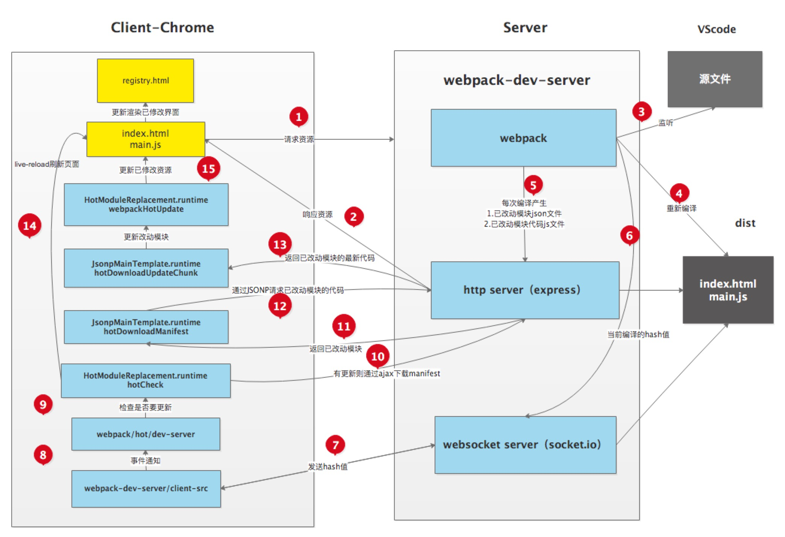

### webpack 热更新原理

Server端使用webpack-dev-server去启动本地服务，内部实现主要使用了webpack、express、websocket。

* 使用express启动本地服务，当浏览器访问资源时对此做响应。
* 服务端和客户端使用websocket实现长连接
* webpack监听源文件的变化，即当开发者保存文件时触发webpack的重新编译。

  * 每次编译都会生成hash值、已改动模块的json文件、已改动模块代码的js文件
  * 编译完成后通过socket向客户端推送当前编译的hash戳

* 客户端的websocket监听到有文件改动推送过来的hash戳，会和上一次对比

  * 一致则走缓存
  * 不一致则通过ajax和jsonp向服务端获取最新资源
  
* 使用内存文件系统去替换有修改的内容实现局部刷新
