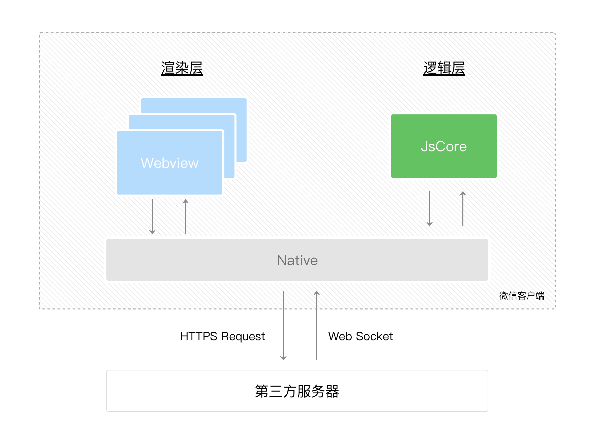
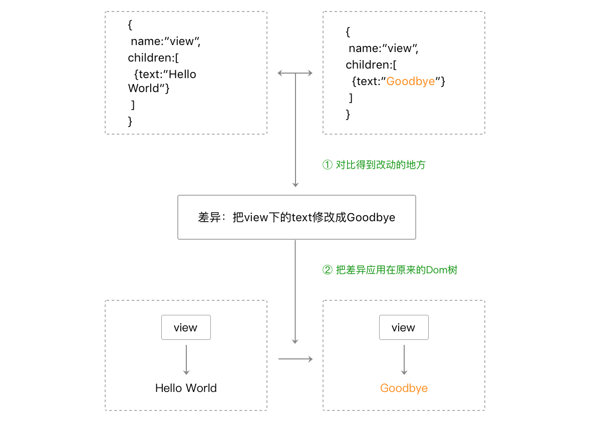
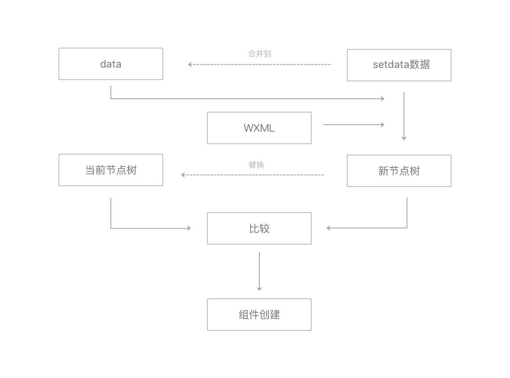
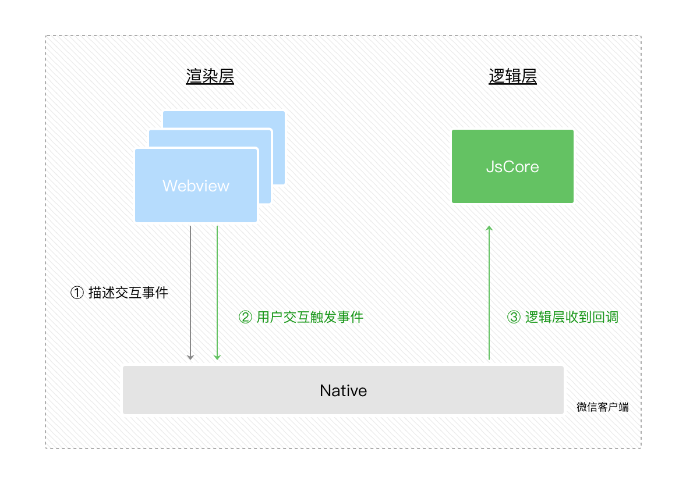

### 微信小程序原理

#### 渲染层和逻辑层

> 由于渲染和逻辑不再同一个浏览器执行，一个在纯JS环境中，一个通过WebView渲染，因此小程序的运行环境分成渲染层和逻辑层，WXML 模板和 WXSS 样式工作在渲染层，JS 脚本工作在逻辑层。

小程序的渲染层和逻辑层分别由2个线程管理：渲染层的界面使用了WebView 进行渲染；逻辑层采用JsCore线程运行JS脚本。一个小程序存在多个界面，所以渲染层存在多个WebView线程，这两个线程的通信会经由微信客户端做中转，逻辑层发送网络请求也经由Native转发，小程序的通信模型如图所示

#### 数据驱动视图变化

小程序的逻辑层和渲染层是分开的两个线程。在渲染层，宿主环境会把WXML转化成对应的JS对象，在逻辑层发生数据变更的时候，我们需要通过宿主环境提供的setData方法把数据从逻辑层传递到渲染层，再经过对比前后差异，把差异应用在原来的Dom树上，渲染出正确的UI界面。

通过setData把msg数据从“Hello World”变成“Goodbye”，产生的JS对象对应的节点就会发生变化，此时可以对比前后两个JS对象得到变化的部分，然后把这个差异应用到原来的Dom树上，从而达到更新UI的目的，这就是“数据驱动”的原理。

#### 事件的处理

UI界面的程序需要和用户互动，例如用户可能会点击你界面上某个按钮，又或者长按某个区域，这类反馈应该通知给开发者的逻辑层，需要将对应的处理状态呈现给用户。由于WebView现在具备的功能只是进行渲染，因此对于事件的分发处理，微信进行了特殊的处理，将所有的事件拦截后，丢到逻辑层交给JavaScript进行处理。（和React的事件对象原理类似）

