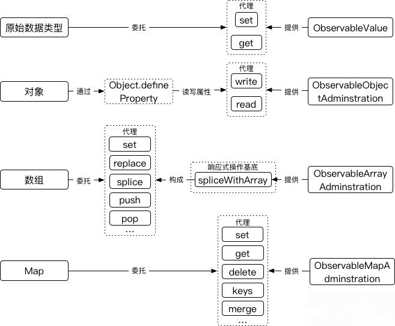

如果数据赋值这一动作委托给某函数处理，我们可以借助 AOP 编程思想，在该函数的执行过程中，添加一些附加操作，如上报变更信息、启用回调函数、或者触发指定事件等。正因为如此，Vue 才得以通过 Object.defineProperty 实现双向数据绑定；React 才得以通过 setState 实现组件重绘。mobx 融合了两种处理手法。首先，mobx 基于原始数据构建 observable 实例，在 observable 实例方法变更数据的过程中，将执行 interceptor, listener, reportChanged 等附加操作，这一机制如同 React 内建的 setState 方法在变更组件状态的同时，还能驱动组件重绘。其次，mobx 通过 Object.defineProperty 将原始数据（对象形式）的赋值、取值动作委托给 observable 实例方法去处理，使得原始数据的赋值动作转变成响应式的、取值动作又能获得原始数据内容，这一过程同 Vue 那样使用了 Object.defineProperty 方法。

### Vue 

vue 是利用的是 Object.defineProperty() 对Object的getter和setter方法修改来对数据进行劫持。 并在数据传递变更的时候封装了一层中转站，即我们看到的 Dep 和 Watcher 两个类

### Mobx 

mobx 基于原始数据构建 observable 实例。

mobx 能将如下几种数据类型转变为 observable 实例：ObservableValue 实例作为代理，能将基本数据类型的赋值动作转变成响应式的；ObservableObjectAdministration 实例能处理对象；ObservableArrayAdministration 实例能处理数组；ObservableMap 实例能处理 map 数据结构。

