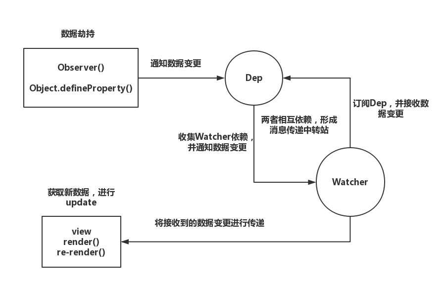

### img

```
 //ig
```

### a

```
/<a.*?href="(.*?)".*?\/?>/ig
```

### 场景

```
const str = ' <a href="https://www.baidu.com" />'

// 上面的2合1
const pattern = /<[img|a].*?[src|href]="(.*?)".*?\/?>/ig

const matchArr = []
const captureArr = []

const result = marked(markdown).replace(pattern, function (match, capture) {
    // match 为 整个 标签
    // capture 为 () 内 匹配的值
    matchArr.push(match)
    captureArr.push(capture)
    return decodeURI(match)
}) 

console.log(matchArr)
console.log(captureArr)
// matchArr 
// ['', '<a href="https://www.baidu.com"']

// captureArr
// ['../markdown-images/vue-data-catch.png', 'https://www.baidu.com']
```

### 处理 svg 的一个 正则 场景

```
const fs = require('fs')

fs.readFile('./test.svg', 'utf8', (err, data) => {
    // 删除 style 和 title 标签
    data = data.replace(/<style>(.*?)<\/style>|<title>(.*?)<\/title>/g, '')

    // 删除 id 和 data-name 属性
    data = data.replace(/<svg.*?(id=".*?") (data-name=".*?").*?>/g, function (match, idCapture, dataNamecapture) {
        // match 为 整个 标签
        // capture 为 () 内 匹配的值
        // matchArr.push(match)
        // captureArr.push(capture)
        // return decodeURI(match)
        return match.replace(idCapture, '').replace(dataNamecapture, '')
    })

    // 删除 空的 defs
    data = data.replace(/<defs><\/defs>/g, '')
    
    // 删除 class 属性
    data = data.replace(/class="(.*?)"/g, '')

    if (err) reject(err)

    console.log(data)
})
```