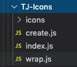

### 一个Icon 方案



从./icons 目录读取 每个 svg 并 通过wrap 函数 包裹 成 一个个 react 组件, 每新增一个icon 运行node ./create.js

#### create.js

```
const fs = require('fs')

const icons = fs.readdirSync('./icons')

const nameArray = icons.reduce((pre, v) => {
    const name = v.split('.')[0]
    if (name) {
        pre.push(name)
    }
    return pre
}, [])

// index.js import 模板
const importTemp = () => `import wrap from './wrap'`

// index.js 模板
const indexTemplate = () =>
    `${importTemp()}

${nameArray
    .map(v => `const ${v.toUpperCase()} = wrap(require('./icons/${v}.svg'))`)
    .join('\n')}

module.exports = {
${nameArray.map(v => `  ${v.toUpperCase()}`).join(',\n')}
}
`

fs.writeFileSync('./index.js', indexTemplate())

```

#### wrap.js
```
const wrap = src => {
    return ({ style, size, width, height, ...rest }) => (
        <div
            style={{
                display: 'inline-flex',
                width: size || height || 14,
                height: size || width || 14,
                minHeight: size || height || 14,
                minWidth: size || width || 14,
                ...(style || {})
            }}
            {...rest}
        >
            
        </div>
    )
}

export default wrap
```

#### index.js 示例

```
import wrap from './wrap'

const ADD = wrap(require('./icons/add.svg'))
const AMR = wrap(require('./icons/amr.svg'))
const CLOUDFILE = wrap(require('./icons/cloudFile.svg'))
const DATASOURCE = wrap(require('./icons/datasource.svg'))
const DELETE = wrap(require('./icons/delete.svg'))
const DIR = wrap(require('./icons/dir.svg'))
const DOC = wrap(require('./icons/doc.svg'))
const DOCX = wrap(require('./icons/docx.svg'))
const DOWNLOAD = wrap(require('./icons/download.svg'))
const EMPTY = wrap(require('./icons/empty.svg'))
const GANTANHAO = wrap(require('./icons/gantanhao.svg'))
const GIF = wrap(require('./icons/gif.svg'))
const HTML = wrap(require('./icons/html.svg'))
const JPG = wrap(require('./icons/jpg.svg'))
const MOV = wrap(require('./icons/mov.svg'))
const MP3 = wrap(require('./icons/mp3.svg'))
const MP4 = wrap(require('./icons/mp4.svg'))
const OTHER = wrap(require('./icons/other.svg'))
const PDF = wrap(require('./icons/pdf.svg'))
const PNG = wrap(require('./icons/png.svg'))
const PPT = wrap(require('./icons/ppt.svg'))
const PROJECT = wrap(require('./icons/project.svg'))
const RAR = wrap(require('./icons/rar.svg'))
const REFRESH = wrap(require('./icons/refresh.svg'))
const SEARCH = wrap(require('./icons/search.svg'))
const SEVENZ = wrap(require('./icons/sevenZ.svg'))
const SVG = wrap(require('./icons/svg.svg'))
const TABLE = wrap(require('./icons/table.svg'))
const TRANSHISTORY = wrap(require('./icons/transHistory.svg'))
const TXT = wrap(require('./icons/txt.svg'))
const ZIP = wrap(require('./icons/zip.svg'))
const ZIPFILE = wrap(require('./icons/zipfile.svg'))
const ZOOMOUT = wrap(require('./icons/zoomOut.svg'))
const LOGO = wrap(require('./icons/logo.svg'))

module.exports = {
    ADD,
    AMR,
    LOGO,
    CLOUDFILE,
    DATASOURCE,
    DELETE,
    DIR,
    DOC,
    DOCX,
    DOWNLOAD,
    EMPTY,
    GANTANHAO,
    GIF,
    HTML,
    JPG,
    MOV,
    MP3,
    MP4,
    OTHER,
    PDF,
    PNG,
    PPT,
    PROJECT,
    RAR,
    REFRESH,
    SEARCH,
    SEVENZ,
    SVG,
    TABLE,
    TRANSHISTORY,
    TXT,
    ZIP,
    ZIPFILE,
    ZOOMOUT
}

```

使用 eg
```
import { ADD } from 'xxx'

import Icons from 'xxx'


<ADD size={14} />
<Icons.ADD size={14} />
```