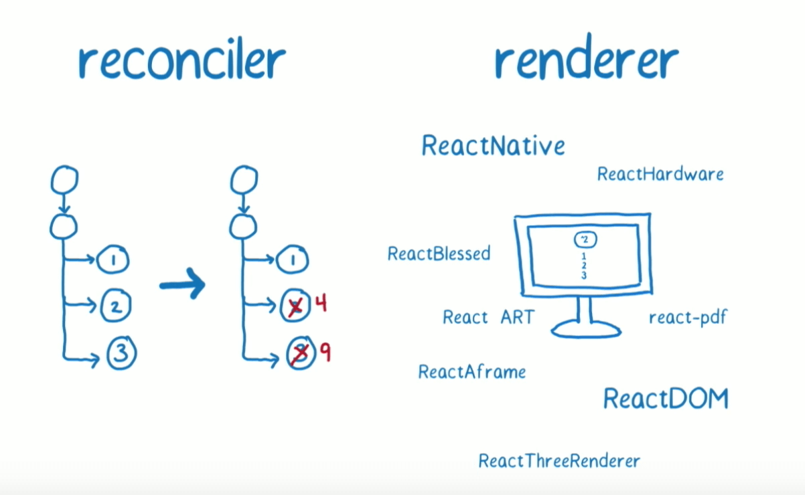
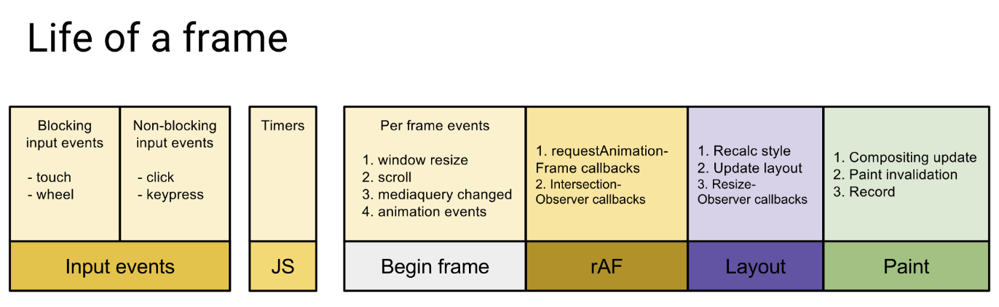
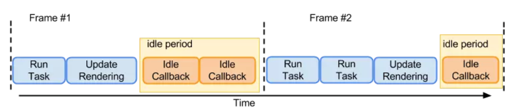
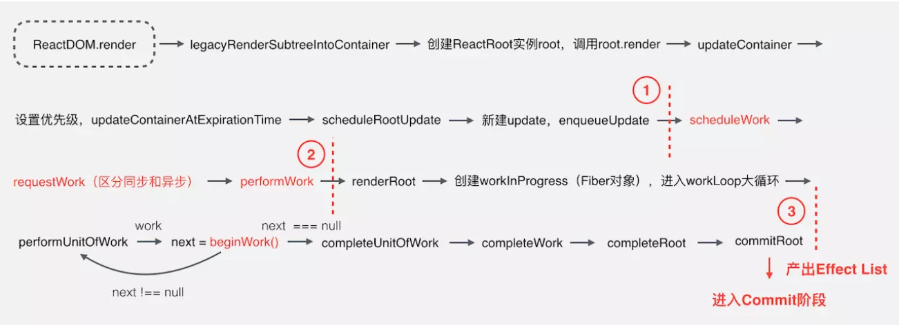

### React 核心思想

内存中维护一棵 虚拟DOM树，数据变化时（setState），自动更新虚拟Dom树，得到一棵新树，然后Diff新旧两颗树，找到有变化的部分，得到一个Change（Patch），将这个Patch添加到队列中，最终批量更新这些Patch到DOM中

### React 16 之前的不足
首先我们先了解下React的工作过程，当我们通过`render()`和`setState()`进行组件渲染和更新的时候，React主要有两个阶段


调和阶段（Reconciler）：官方解释，React 会从上而下通过递归，遍历新数据生成新的Virtual DOM，然后通过Diff算法，找到需要变更的元素（Patch），放到更新队列里面去。
渲染阶段（Rendderer）：遍历更新队列，通过调用宿主环境API，实际更新渲染对应元素。宿主环境，比如DOM，NATIVE，WebGL等。

在调和阶段，由于采用的递归的遍历方式，这种也被称为Stack Reconciler，主要是为了区别Fiber Reconciler取的一个名字。这种方式有一个特点：一旦任务开始进行，就无法中断，那么js将一直占用主进程，一直等整棵虚拟DOM树计算完成之后，才能把执行权交给渲染引擎，那么就会导致一些用户交互、动画等任务无法立即得到处理，就会有卡顿，非常影响用户体验。

### 如何解决之前的不足

> 之前的问题主要是任务一但执行，就无法中断，js线程一直占用主线程，导致卡顿

#### 浏览器每一帧都需要完成哪些工作?

页面是一帧一帧绘制出来的，当每秒绘制的帧数（FPS）达到60时，页面是流畅的，小于这个值时，用户会感觉到卡顿。

1s 60帧，每一帧分到的时间是 1000 / 60 大约 16ms。所以我们书写代码是力求 不让一帧的 工作量 耗时 超过16ms



##### 浏览器内一帧的工作

通过上图可看到，一帧内需要完成如下六个步骤的任务：
* 处理用户的交互
* JS解析执行
* 帧开始。窗户尺寸变更，页面滚动等处理
* requestAnimationFrame
* 布局
* 绘制

如果这六个步骤中，任意一个步骤所占用的时间过长，总时间超过了16ms之后，用户也许会感觉卡顿。

而在上一小节所说到的调和阶段耗时比较长，也就是js执行耗时过长，那么就有可能在用户有交互的时候，本来应该渲染下一帧了，但是还在下一帧中执行js，就导致用户交互不能到马上得到反馈，从而产生卡顿感。


#### 解决方案
把渲染过程拆分成多个子任务，每次只做一小部分，做完看是否还有剩下的时间，如果有，继续下一个任务；否则，挂起当前任务，将时间控制权交给主线程，等主线程不忙的时候，再继续执行。这种策略称为 `Cooperative Scheduling（合作式调度）`，操作系统常用的任务调度策略之一。

合作式调度主要就是用来分配任务的，当有更新任务传来的时候，不马上做Diff操作，而是先把当前的更新送入到一个 Update Quene 中，再交给 Scheduler 去处理，Scheduler 会根据当前主线程的使用情况去处理当前 Update。为了实现这种特性，使用了`requestIdleCallback`API。对于不支持该API的浏览器，React会加上pollyfill。

在上面我们已经知道了浏览器是一帧一帧执行的，在两个执行帧间，主线程通常会有一小段空闲时间，`requestIdleCallback`可以在这个`空闲期（Idle Period）调用空闲回调（Idle Callback）`，执行一些任务。



* 低优先级的任务由requestIdleCallback
* 高优先级的任务，如动画相关的交由requestAnimationFrame处理
* requestIdleCallback可以在多个空闲期回调，执行任务
* requestIdleCallback方法提供deadline，即任务执行限制时间，以切分任务，避免长时间运行，阻塞UI渲染而导致掉帧
  
这个方案看起来确实不错，但是怎么实现可能会遇到几个问题：

* 如何拆分成子任务？
* 一个子任务多大合适？
* 怎么判断是否还有剩余时间？
* 有剩余时间怎么去调度应该执行哪个任务？
* 没有剩余时间任务会怎么办？

接下来整个Fiber架构就是来解决这些问题的。

### 什么是Fiber

为了解决上面提出的问题，提出了以下几个目标：

* 暂停工作，稍后再回来
* 为不同类型任务分配优先权（设置权重）
* 重用以前完成的工作
* 如果不再需要，则中止任务
  
为了做到这些，我们首先需要一种方法将任务分解为单元。从某种意义上讲，Fiber代表工作单元。

但是仅仅分解为单元还是不能做到中断任务，因为函数调用栈就是这样，每个函数为一个工作，每个工作被称为堆栈帧，它会一直工作，直到堆栈为空，无法中断。

因此Fiber就是重复实现的堆栈帧，本质上Fiber 可以理解为一个虚拟的堆栈帧，将可中断的任务拆解为多个子任务，通过按照优先级来自由调度子任务，分段更新，从而将之前的渲染改为异步渲染。

所以我们可以说Fiber 是一种数据结构（堆栈帧），也可以说是一种解决可中断地调用任务的一种解决方案，它的特性就是 `时间分片（Time Slicing）` 和  `暂停（Supense）`

> 如果了解协程的话可能会觉得Fiber的这种解决方案，跟协程有点像（还是有很大区别），是可中断的，可以控制执行顺序。在JS 的 Generator 其实就是一种协程的使用方式，不过颗粒度更小，可以控制函数里面的代码调用的顺序，也可以中断。

### Fiber 是 如何工作的

1. `ReactDOM.render()` `setState`的时候开始创建更新
2. 将创建的更新加入任务队列，等待调度
3. 在requestIdleCallback空闲时执行
4. 从根节点开始遍历Fiber Node，并且构建 WorkInProgress Tree
5. 生成EffectList
6. 根据EffectList更新DOM



1. 第一部分从`ReactDOM.render()` 方法开始，把接收到的React Element转换为Fiber节点，并为其设置优先级，创建Update，加入到更新队列，这部分主要做一些初始数据的准备
2. 第二部分主要是三个函数：`scheduleWork` `requestWork` `performWork`，安排工作、申请工作、正式工作三个部分，React16 新增的异步调用功能则在这部分实现，这部分就是Schedule阶段，前面介绍的Cooperative Scheduling就是在这个阶段，只有在这里解决获取到可执行的时间片，第三部分才会继续执行。具体如何调度的，后面文章再介绍，这是React调度的关键过程。
3. 第三部分是个大循环，遍历所有的Fiber节点，通过Diff算法计算所有更新工作，产出EffecList给到commit阶段使用，这部分核心是beginWork函数，这部分基本就是Fiber reconciliation 和 commit 阶段。

### Fiber Node
Fiber Node，承接了非常关键的上下文信息，可以说是贯穿了真个创建和更新过程，下面分组列了一些重要的Fiber字段。

```
{
  ...
  // 跟当前Fiber相关本地状态（比如浏览器环境就是DOM节点）
  stateNode: any, 

  // 单链表结构
  return: Fiber | null, // 指向他在Fiber节点树中的 parent， 用来处理完这个节点之后向上返回
  child: Fiber | null, // 指向自己的第一个子节点
  sibling:  Fiber | null,  // 指向自己的兄弟节点， 兄弟节点的return 指向同一个父节点

  // 更新相关
  pendingProps: any, // 新的变动带来的新的props
  memoizedProps: any,  // 上一次渲染完成之后的props
  updateQueue: UpdateQueue<any> | null, // 该Fiber对应的组件产生的Update会存放在这个队列中
  memoizedState: any, // 上一次渲染时的state

  // Scheduler 相关
  expirationTime: ExpirationTime, // 代表任务未来的哪个时间点应该被完成，不包括它的子树产生的任务
  // 快速确定子树中是否有不再等待的变化
  childExpirationTime: ExpirationTime,

  // 在Fiber树更新的过程中，每一个Fiber都有一个对应的Fiber
  // 我们称为 current -> workInProgress
  // 在渲染完成之后它们会交换位置
  alternate: Fiber | null,

  // Effect 相关  
  effectTag: SideEffectTag, // 用来记录Side Effect
  nextEffect: Fiber | null, // 单链表用来快速查找下一个sideEffect
  firstEffect: Fiber | null,  // 子树中第一个side effect
  lastEffect: Fiber | null, // 子树中最后一个side effect
  ....
}
```

### Fiber Reconciler

在第二部分，进行Scheduler完，获取到时间片之后，就开始进行reconcile。

Fiber Reconciler 是 React 中的 调和器，这也是任务调度完成之后，如何去执行每个任务，如何去更新每个节点的过程，对应上面的第三部分。


### Fiber
背景
我们知道 React 是通过递归的方式来渲染组件的，在 V16 版本之前的版本里，当一个状态发生变更时，react 会从当前组件开始，依次递归调用所有的子组件生命周期钩子，而且这个过程是同步执行的且无法中断的，一旦有很深很深的组件嵌套，就会造成严重的页面卡顿，影响用户体验。

React 在V16版本之前的版本里引入了 Fiber 这样一个东西，它的英文涵义为纤维，在计算机领域它排在在进程和线程的后面，虽然 React 的 Fiber 和计算机调度里的概念不一样，但是可以方便对比理解，我们大概可以想象到 Fiber 可能是一个比线程还短的时间片段。

#### Fiber 到底做了什么事
Fiber 把当前需要执行的任务分成一个个微任务，安排优先级，然后依次处理，每过一段时间（非常短，毫秒级）就会暂停当前的任务，查看有没有优先级较高的任务，然后暂停（也可能会完全放弃）掉之前的执行结果，跳出到下一个微任务。同时 Fiber 还做了一些优化，可以保持住之前运行的结果以到达复用目的。

#### 举个潜水员的例子

我们可以把调度当成一个潜水员在海底寻宝，v16 之前是通过组件递归的方式进行寻宝，从父组件开始一层一层深入到最里面的子组件

而替换成了 Fiber 后，海底变成的狭缝（简单理解为递归变成了遍历），潜水员会每隔一小段时间浮出水面，看看有没有其他寻宝任务。注意此时没有寻到宝藏的话，那么之前潜水的时间就浪费了。就这样潜水员会一直下潜和冒泡


#### 时间分片
原理： 在每一帧的中会先执行 macrotasks 任务 -> 再执行 UI rendering -> 最后有剩余时间执行 Idle 回调


react 16 之前，react 通过虚拟 dom 更新是同步的，一旦有更新就会一直执行到更新完毕, 如果更新很复杂就会一直占用浏览器主线程，这时候浏览器本身的动画和用户输入操作就会出现卡顿或没响应。

react 16 后，采用时间片的方式解决更新卡顿的问题。
给每个 react 更新任务一个过期时间 timeout，维护一个 react 更新队列
通过 requestAnimationFrame 找到每一帧的开始时间，再计算出下一帧的开始时间
把优先级最高的 react 更新任务推入 event loop 的 tasks queue 中
每次 event loop 开始 react 更新的 tasks 时都会检查这个任务是否到期 timeout 了，只有 timeout 时才会执行
react 更新任务会先进入 renderRoot 渲染阶段更新 fiberTree 上的内容，再进行 completeRoot 提交阶段更改 dom 的最终结果。
react 更新任务 didTimeout 过期时执行 renderRoot ，这个渲染阶段哪怕时间很长也最大限度的保证了浏览器高优先级别的动画和用户输入的流畅运行

调度时通过 requestAnimationFrame api 在浏览器每次重绘前做想做的事
requestAnimationFrame 回调 animationTick 在浏览器动画执行前 执行
他在 animationTick 中确定了下一帧结束的时间点
因为不知道 react 更新需要多少时间，所以没有在 animationTick 中判断 timeRemaining() 当前帧剩余时间来执行 react 更新
而是把用于 react 更新的 flushWork 通过 postMessage 推入下个 tick 事件队列中的 idleTick 回调，也就是 macrotasks
在 window.addEventListener(‘message’, idleTick, false); 的 idleTick 中一直拖到 frameDeadline - currentTime <= 0 当前帧完全过期时
才把 didTimeout = true, 再 执行 prevScheduledCallback(didTimeout); - flushWork(didTimout) 这次 react 更新。
这次 macrotasks 的 flushWork 先于 requestAnimationFrame 执行
这时 flushWork 就算更新时间超过当前帧剩余时间借用了下一帧的时间，也是最大限度的保证了浏览器动画的流畅性和优先级。
