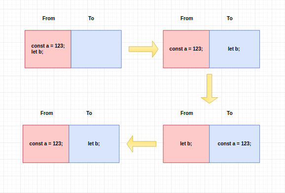

### js 内存回收

#### 标记-清楚算法

这个算法假定 设置一个根（root）的对象（在JavaScript里，根是全局对象）。垃圾回收器将定期从根开始，找所有从根开始引用的对象，然后找这些对象应用的对象。。。从根开始，垃圾回收器将找到所有可获取到的对象和收集到不可获取到的对象


#### v8引擎 的回收机制

##### V8 内存管理及垃圾回收机制浅析
由于 V8 引擎的原因，Node 在操作大内存对象时受到了一些限制，在 64 位的机器上，默认最大操作的对象大小约为 1.4G，在 32 位的机器上，默认最大操作的对象大小约为 0.7G。
如果我们的 Node 程序会经常操作一些大内存的对象，可以对这个默认值进行修改：
```
node --max-old-space-size=1700 index.js
node --max-new-space-size=1024 index.js
```

其中，max-old-space-size 表示设置老生代内存空间的最大容量，max-new-space-size 表示这只新生代内存空间的最大容量。但这两个值也是有上限的，不能无限设置，其中老生代内存空间最大的值约为 1.7G，新生代最大内存空间约为 1.0G

##### 新生代和老生代

V8 将内存分为两类：新生代内存空间和老生代内存空间，新生代内存空间主要用来存放存活时间较短的对象，老生代内存空间主要用来存放存活时间较长的对象。对于垃圾回收，新生代和老生代有各自不同的策略，下面依次进行介绍。


##### 新生代垃圾回收

新生代内存中的垃圾回收主要通过 Scavenge 算法进行，具体实现时主要采用了 Cheney 算法。Cheney 将内存空间一分为二，每部分都叫做一个 Semispace，这两个 Semispace 一个处于使用，一个处于闲置。处于使用中的 Semispace 也叫作 From，处于闲置中的 Semispace 也叫作 To。
在垃圾回收运行时时，会检查 From 中的对象，当某个对象需要被回收时，将其留在 From 空间，剩下的对象移动到 To 空间，然后进行反转，将 From 空间和 To 空间互换。进行垃圾回收时，会将 To 空间的内存进行释放，如下图所示：



简而言之，就是 From 空间中存放不需要被回收的对象，To 空间中存放需要被回收的对象，当垃圾回收运行时，将 To 空间中的对象全部进行回收。

##### 新生代对象的晋升

前面说过，新生代内存空间用来存放存活时间较短的对象，老生代内存空间用来存放存活时间较长的对象。新生代中的对象可以晋升到老生代中，具体有两种方式：

在垃圾回收的过程中，如果发现某个对象之前被清理过，那么会将其晋升到老生代内存空间中
在 From 空间和 To 空间进行反转的过程中，如果 To 空间中的使用量已经超过了 25%，那么就将 From 中的对象直接晋升到老生代内存空间中
