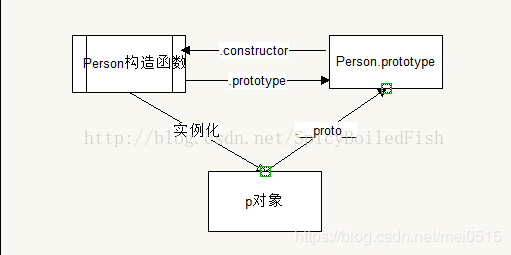

### 原型与原型链

每个实例对象（object）都有一个私有属性（称之为__proto__）指向它的构造函数的原型对象（prototype）。该原型对象也有一个自己的原型对象（__proto__）,层层向上直到一个对象的原型对象为null。根据定义null没有原型，并作为原型链中的最后一个环节。

构造函数中有prototype属性，是一个对象，称之为原型对象；
该构造函数的原型对象中有 constructor 构造器指向自己的构造函数。
构造函数可以实例化对象，实例化对象有__proto__，它指向为该构造函数的原型对象；

#### 原型

1. 实例对象的__proto__这个属性，叫原型，是一个对象，供浏览器使用，不是标准的属性，__proto__可以称之为原型对象；
2. 构造函数中的prototype属性，叫原型，是一个对象，对开发者使用。同时构造函数中的prototype称之为原型对象；

#### 原型链

实例对象和原型对象之间的关系就叫原型链。他们的关系是通过原型__proto__联系

